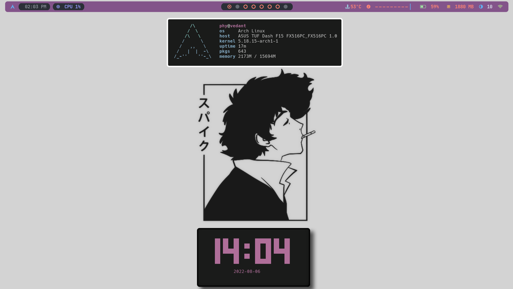
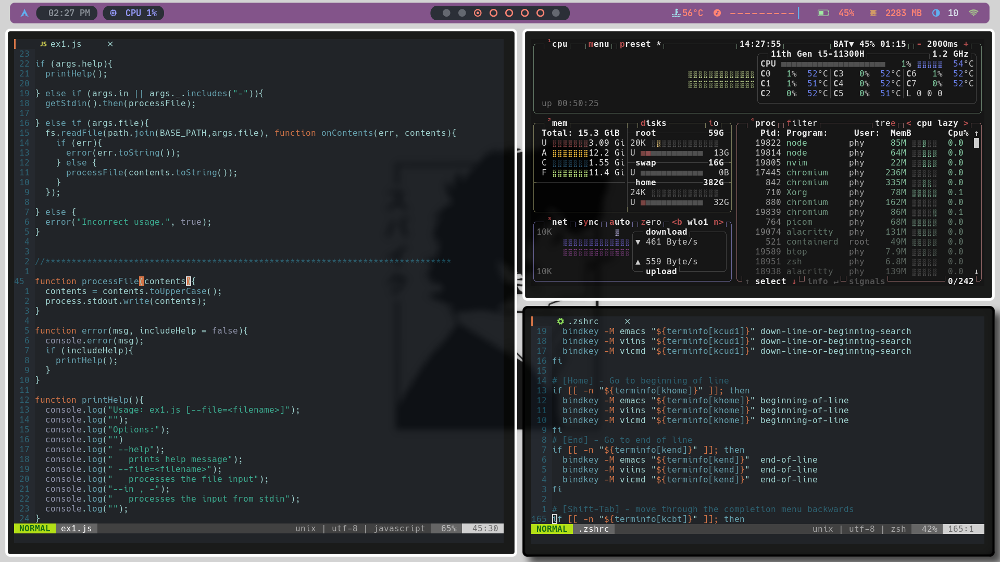

# I USE ARCH BTW




## Setup Info

Here are some details about my setup:

- **OS:** [Arch Linux](https://archlinux.org)
- **WM:** [bspwm](https://github.com/baskerville/bspwm)
- **Terminal:** [alacritty](https://github.com/alacritty/alacritty.git)
- **Shell:** [zsh](https://www.zsh.org/)
- **Editor:** [neovim](https://github.com/neovim/neovim) / [vscode](https://github.com/microsoft/vscode)
- **Compositor:** [picom](https://github.com/Arian8j2/picom-jonaburg-fix.git)
- **Application Launcher:** [rofi](https://github.com/davatorium/rofi)

## Installation

Clone the repository into your `$HOME` directory  

```bash
git clone https://github.com/vedant-204/dotfiles_stow.git ~
```

Run `stow` to symlink everything or just select what you want

```bash
cd dotstow/base/ && stow */  -t ~
```

`stow` Everything (`\*/` ignores the README or any `file`)  
 `flags` `-t ~` implies , target directory is `$HOME`

```bash
$ pwd
/
└ home
  └ phy
    └ dotfiles_stow
      └ base

stow zsh -t ~
# for zsh config
```

```bash
nvim -c ':PlugInstall' -c ':qall'
# install all neovim plugins and exit
```

